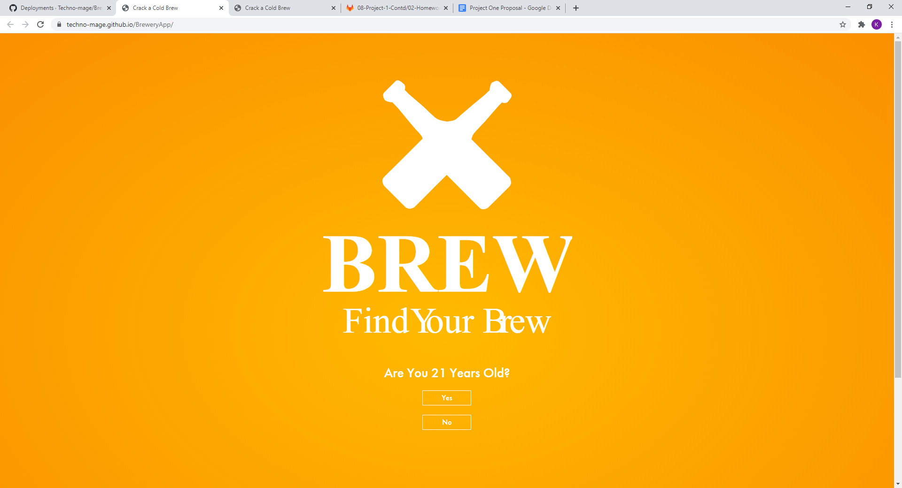
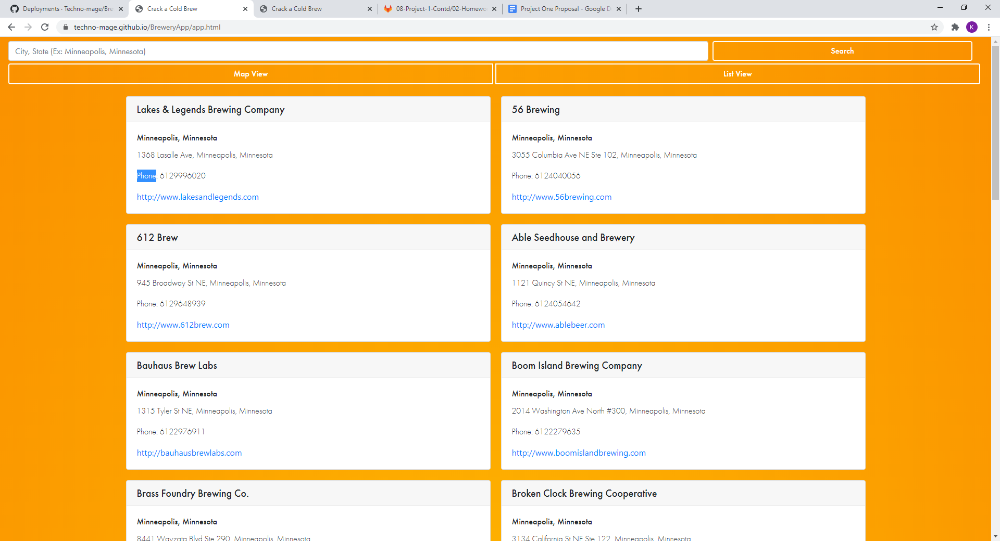
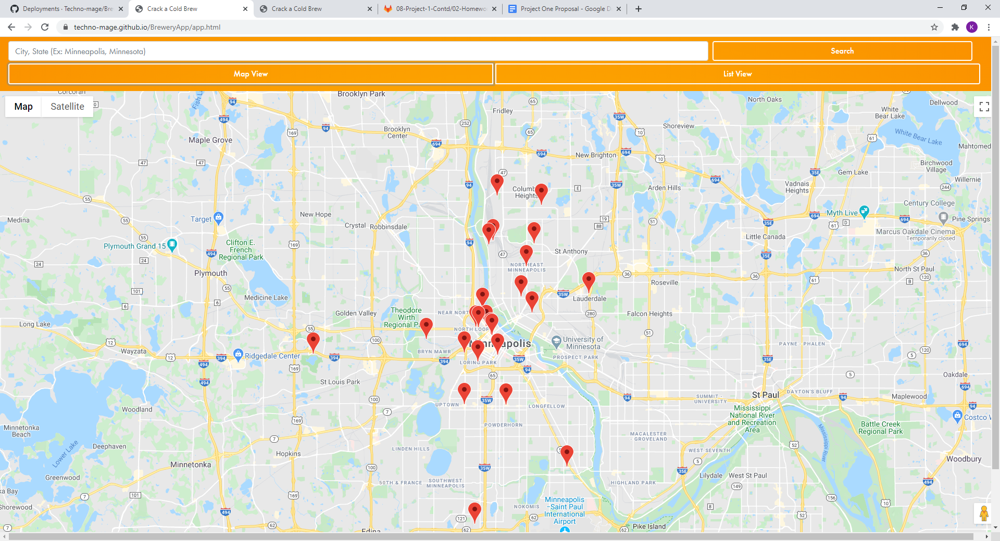

# BreweryApp

This is an app that allows the user to locate local breweries near them, and provide a map.

# Motivation
In the ever popular and growing industry of Local Breweries. This app was designed because the need for being able to find new local breweries. 

# Build Status
Build Status of continuous integration.

# Screenshots

# Tech

-Jquery
-Bootstrap
-Google Maps API
-Open Brewery DB API
-Adobe Type Kit
-CSS Grid

# Feaatures
- being able to find breweries on a list or map view.

# Colaberators 

* Andrew Westgard
* Erik Schaal
* Kyle Rudderforth
* Matthew Huus

# API Reference
Google Maps- https://developers.google.com/maps/documentation/javascript/tutorial
Open Brewery DB- https://www.openbrewerydb.org/

# How to use?
Type the desired city and state and the app will return results on a list or a map.

# Contribute
Right now we are not allowing other contributers.

# Repo links
repo - https://github.com/Techno-mage/BreweryApp
git pages -https://techno-mage.github.io/BreweryApp/
